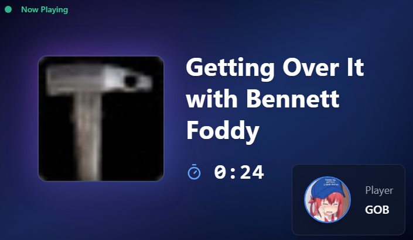
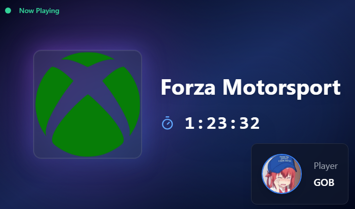

# 🎮 Steam Gaming Tracker for DeskThing

<div align="center">

Track your gaming sessions in real-time on your DeskThing display! This app shows your currently playing game with a live timer, Steam profile with avatar and status, and automatically fetches game artwork.

</div>

---

## ✨ Features

<table>
<tr>
<td width="50%">

**🎯 Real-time game tracking**  
See what you're playing as it happens

**⏱️ Live session timer**  
Track how long you've been playing

**👤 Steam profile integration**  
Display your avatar and online status

</td>
<td width="50%">

**🖼️ Automatic game artwork**  
Beautiful game covers fetched automatically

**💬 Discord integration**  
Uses Discord Lanyard for real-time game detection

</td>
</tr>
</table>

---

## 🔧 Requirements

<div align="center">

| Requirement | Description |
|------------|-------------|
| 🔑 **Steam API Key** | Required for Steam integration |
| 🆔 **Steam ID** | Your unique Steam identifier |
| 💬 **Discord ID** | Your Discord user ID |

</div>

---

## 📝 Setup Instructions

<div align="center">

### ⚠️ **IMPORTANT: Keep Your API Key Private!**
### **DO NOT SHARE YOUR STEAM API KEY WITH ANYONE!**

</div>

---

### 1️⃣ Get Your Steam API Key

<details open>
<summary><b>Click to expand instructions</b></summary>

<br>

1. 🌐 Go to: https://steamcommunity.com/dev/apikey
2. 📝 Enter any domain name (you can put whatever you want, e.g., `localhost`)
3. 📱 You'll need to verify this request in the Steam Mobile App:
   - Open the **Steam Mobile App**
   - Go to **Menu** → **Confirmations**
   - Verify the API key request
4. 💾 Once verified, copy your API key and save it somewhere safe

</details>

---

### 2️⃣ Get Your Steam ID

<details open>
<summary><b>Click to expand instructions</b></summary>

<br>

1. 💻 Open **Steam** on your PC
2. 👤 Go to your **Steam Profile**
3. 🖱️ **Right-click** on your profile page
4. 📋 Select **"Copy Page URL"**
5. 🔢 Your Steam ID is the number string in the URL

<br>

> **Example URL:**
> ```
> https://steamcommunity.com/profiles/76561198409995/
> ```
> In this example, your Steam ID is: `76561198409995`

</details>

---

### 3️⃣ Get Your Discord ID

<details open>
<summary><b>Click to expand instructions</b></summary>

<br>

1. 💬 Open **Discord**
2. ⚙️ Go to **Settings** → **Advanced**
3. 🔧 Enable **Developer Mode**
4. ❌ Close settings and click on your profile picture
5. 📋 Click **"Copy User ID"**
6. 💾 Save this ID for the app configuration

</details>

---

## 🚀 Configuration

<div align="center">

Once you have all three IDs:

```
1️⃣ Enter your Steam API Key
2️⃣ Enter your Steam ID
3️⃣ Enter your Discord ID
4️⃣ Save and enjoy real-time game tracking!
```

</div>

---

## 📸 Preview

<div align="center">

### Example of app playing supported Steam game 


<br><br>

### Example of app playing a non-Steam game 


</div>

---

## 🛠️ Technical Details

<div align="center">

| Component | Purpose |
|-----------|---------|
| **Steam Web API** | For fetching game data and profile information |
| **Discord Lanyard** | For real-time game detection through Discord Rich Presence |
| **DeskThing Platform** | Display framework |

</div>

---

## ❓ Troubleshooting

<table>
<tr>
<th>Issue</th>
<th>Solution</th>
</tr>
<tr>
<td><b>🎮 Game not showing up?</b></td>
<td>
• Verify your Discord ID is correct<br>
• Check that your Steam profile is set to public
</td>
</tr>
<tr>
<td><b>👤 Profile not loading?</b></td>
<td>
• Confirm your Steam API key is valid<br>
• Ensure your Steam ID is correct
</td>
</tr>
</table>

---

<div align="center">

**Enjoy tracking your gaming sessions! 🎮✨**

<br>

Made with ❤️ for DeskThing

</div>